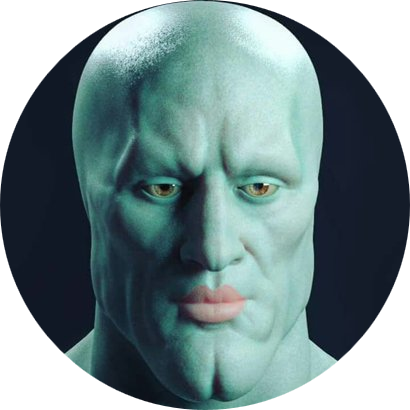

# -= BotShot =-

Este bot está pensado para procesar imágenes ~~(en su mayoría +18)~~ y
almacenarlas en un directorio designado acorde.

 
 
 

**Creado por:**

[Facundo "BonShot" Aguirre Argerich](https://github.com/bonshot)

[Franco "NLGS" Lighterman Reismann](https://github.com/NLGS2907)

* **[Enlace de Invitación]()**

* **[Dependencias](requirements.txt)**

    - [python-dotenv](https://pypi.org/project/python-dotenv/)

    - [pycord](https://pypi.org/project/py-cord/) (rama `master`)

* **[Licencia MIT](LICENSE)**

* **[Cómo contribuir y Convenciones usadas](CONTRIBUTING.MD)**

 
